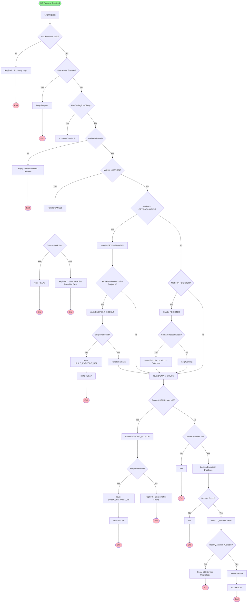
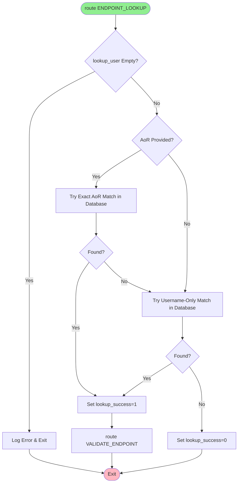
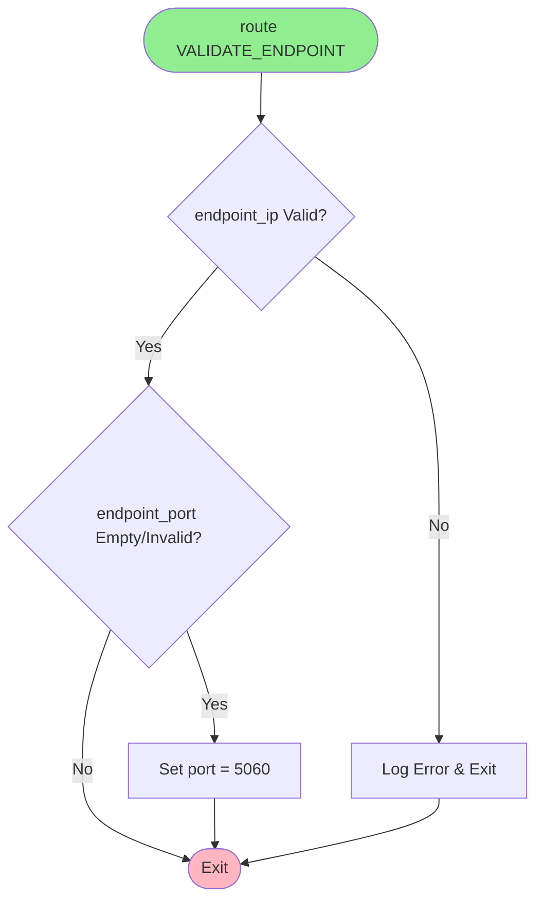
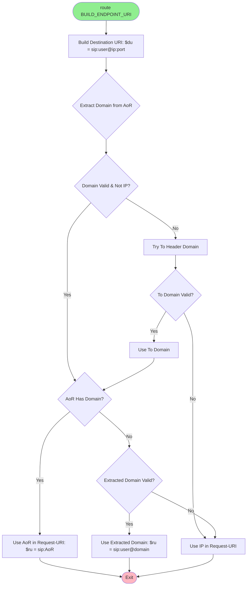
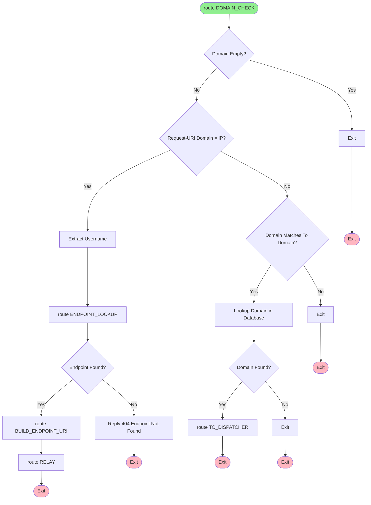
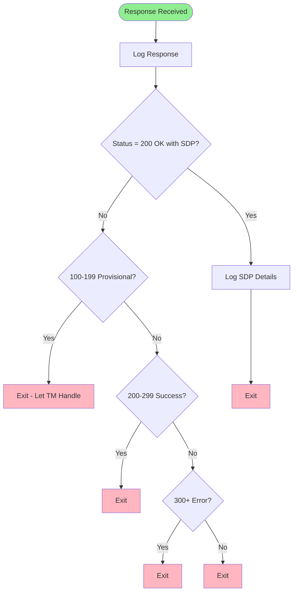
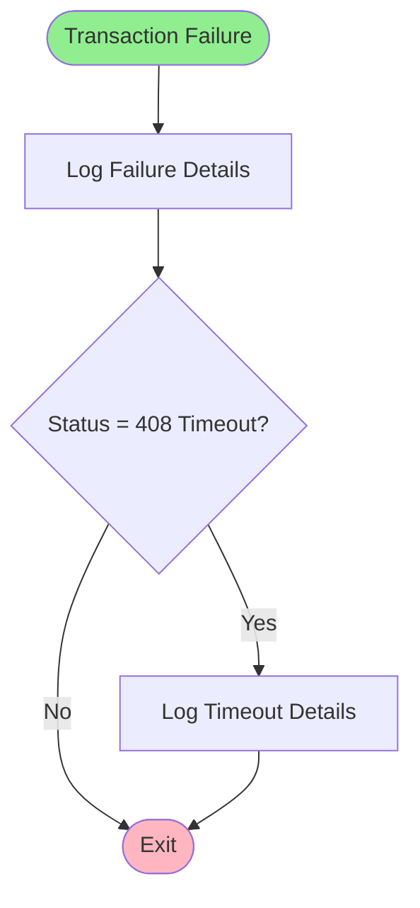
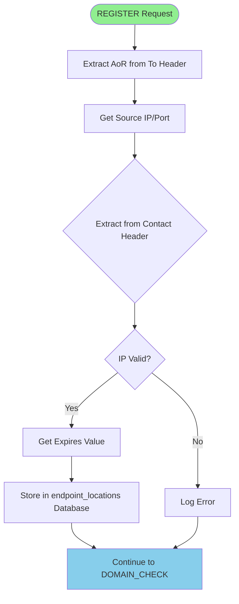
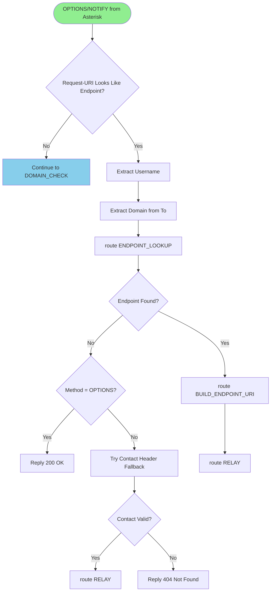
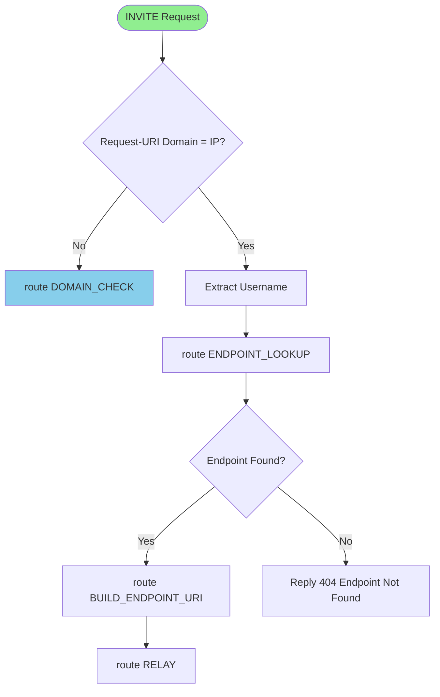

# OpenSIPS Configuration Logic Diagram

This document provides a visual representation of the routing logic in `opensips.cfg.template`.

## Main Request Flow



## Helper Routes

### ENDPOINT_LOOKUP



### VALIDATE_ENDPOINT



### BUILD_ENDPOINT_URI



## Route Details

### route WITHINDLG (In-Dialog Requests)

```mermaid
flowchart TD
    Start([route WITHINDLG]) --> TryLooseRoute{loose_route() Succeeds?}
    TryLooseRoute -->|Yes| Relay1[route RELAY]
    TryLooseRoute -->|No| CheckBYE{Method = BYE?}
    CheckBYE -->|Yes| CheckTrans{Transaction Exists?}
    CheckBYE -->|No| Reply404[Reply 404 Not Here]
    CheckTrans -->|Yes| Relay2[route RELAY]
    CheckTrans -->|No| Relay3[route RELAY - Try Anyway]
    Relay1 --> End1([Exit])
    Relay2 --> End2([Exit])
    Relay3 --> End3([Exit])
    Reply404 --> End4([Exit])
    
    style Start fill:#90EE90
    style End1 fill:#FFB6C1
    style End2 fill:#FFB6C1
    style End3 fill:#FFB6C1
    style End4 fill:#FFB6C1
```

### route DOMAIN_CHECK



### route TO_DISPATCHER

```mermaid
flowchart TD
    Start([route TO_DISPATCHER]) --> SelectDst{ds_select_dst() Healthy Node?}
    SelectDst -->|No| Reply503[Reply 503 Service Unavailable]
    SelectDst -->|Yes| RecordRoute[Add Record-Route Header]
    RecordRoute --> ArmFailure[t_on_failure]
    ArmFailure --> Relay{t_relay() Succeeds?}
    Relay -->|Yes| End1([Exit])
    Relay -->|No| Reply500[Reply 500 Internal Server Error]
    Reply503 --> End2([Exit])
    Reply500 --> End3([Exit])
    
    style Start fill:#90EE90
    style End1 fill:#FFB6C1
    style End2 fill:#FFB6C1
    style End3 fill:#FFB6C1
```

### route RELAY

```mermaid
flowchart TD
    Start([route RELAY]) --> ArmFailure[t_on_failure]
    ArmFailure --> Relay{t_relay() Succeeds?}
    Relay -->|Yes| End1([Exit])
    Relay -->|No| Reply500[Reply 500 Internal Server Error]
    Reply500 --> End2([Exit])
    
    style Start fill:#90EE90
    style End1 fill:#FFB6C1
    style End2 fill:#FFB6C1
```

## Response Handling

### onreply_route



### failure_route[1]



## Method-Specific Flows

### REGISTER Flow



### OPTIONS/NOTIFY Flow (from Asterisk)



### INVITE Flow (to Endpoint)



## Key Decision Points

1. **In-Dialog Detection**: `has_totag()` - Routes to `WITHINDLG` if To-tag exists
2. **Method Validation**: Only allows REGISTER, INVITE, ACK, BYE, CANCEL, OPTIONS, NOTIFY, SUBSCRIBE
3. **Endpoint Detection**: Checks if Request-URI domain is an IP address (regex pattern)
4. **Domain Lookup**: Queries `sip_domains` table to find dispatcher setid
5. **Dispatcher Selection**: Uses `ds_select_dst()` to find healthy Asterisk backend
6. **Endpoint Lookup**: Queries `endpoint_locations` table for registered endpoint IP/port

## Database Tables Used

- **sip_domains**: Maps domain names to dispatcher set IDs
- **dispatcher**: Contains Asterisk backend destinations with health status
- **endpoint_locations**: Stores registered endpoint IP/port information

## Helper Route Dependencies

```
ENDPOINT_LOOKUP
  └─> VALIDATE_ENDPOINT

BUILD_ENDPOINT_URI
  (uses output from ENDPOINT_LOOKUP)
```

## Notes

- All routes use `exit;` to terminate processing
- Transaction module (`tm`) handles INVITE transaction state automatically
- Record-Route headers are added for requests going through OpenSIPS
- Health checks via dispatcher module send OPTIONS to Asterisk backends
- Endpoint locations are stored during REGISTER and used for direct routing

