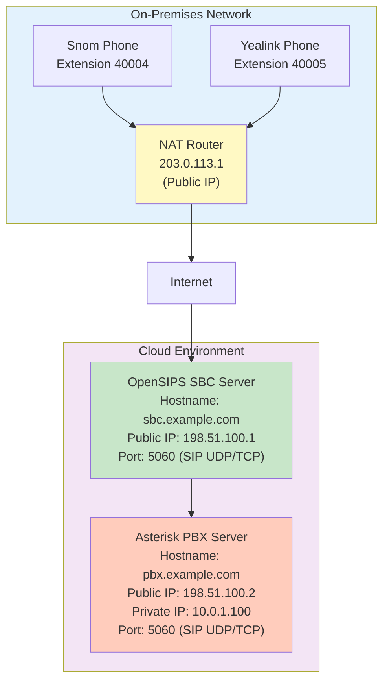

# Test Environment Documentation

## Overview
This document describes the cloud-based test environment for OpenSIPS and Asterisk deployment, with phones located on-premises behind NAT.

## Network Topology



## Component Details

### Phones (On-Premises, Behind NAT)

| Component | Extension | Type | Location | NAT Gateway |
|-----------|-----------|------|----------|-------------|
| Phone 1 | 40004 | Snom | On-Premises | 203.0.113.1 |
| Phone 2 | 40005 | Yealink | On-Premises | 203.0.113.1 |

**Network Configuration:**
- Both phones are behind the same NAT gateway
- Public NAT IP: `203.0.113.1`
- Phones register with OpenSIPS using their private IPs
- OpenSIPS tracks endpoint locations for routing

### OpenSIPS SBC Server (Cloud)

| Property | Value |
|----------|-------|
| Hostname | `sbc.example.com` |
| Public IP | `198.51.100.1` |
| Service | OpenSIPS SIP Edge Router |
| Ports | 5060 (SIP UDP/TCP), 5061 (SIP TLS) |
| Database | SQLite at `/var/lib/opensips/routing.db` |

**Configuration:**
- `advertised_address` must be set to: `198.51.100.1`
- Listens on all interfaces (`0.0.0.0:5060`)
- Routes SIP traffic between phones and Asterisk
- Tracks endpoint locations for routing Asterisk-to-phone calls (INVITE, OPTIONS, NOTIFY)

**Installation:**
```bash
sudo ./install.sh --advertised-ip 198.51.100.1
```

### Asterisk PBX Server (Cloud)

| Property | Value |
|----------|-------|
| Hostname | `pbx.example.com` |
| Public IP | `198.51.100.2` |
| Private IP | `10.0.1.100` |
| Service | Asterisk PBX |
| Port | 5060 (SIP UDP/TCP) |

**Network Configuration:**
- Has both public and private IP addresses
- Public IP: `198.51.100.2` (for external access)
- Private IP: `10.0.1.100` (for internal cloud network)
- OpenSIPS dispatcher should use the private IP for routing within cloud

**Dispatcher Configuration:**
The dispatcher entry in OpenSIPS database should use the private IP:
```sql
INSERT INTO dispatcher (setid, destination, state, weight, priority) 
VALUES (10, 'sip:10.0.1.100:5060', 0, '1', 0);
```

**Asterisk NAT Configuration:**
As documented in `docs/ASTERISK-NAT-WITH-PROXY.md`, Asterisk should use:
```
nat=force_rport
localnet=10.0.0.0/16
```

## Traffic Flows

### 1. Phone Registration (REGISTER)
```
Phone (40004/40005) → NAT (203.0.113.1) → Internet → OpenSIPS (198.51.100.1)
```
- Phone sends REGISTER to OpenSIPS
- OpenSIPS extracts Contact header and source IP
- Stores endpoint location in `endpoint_locations` table
- Forwards REGISTER to Asterisk (if needed)

### 2. Phone-to-Phone Call (via Asterisk)
```
Phone 40004 → OpenSIPS → Asterisk → OpenSIPS → Phone 40005
```
- Phone sends INVITE with domain in Request-URI (e.g., `sip:40005@example.com`)
- OpenSIPS routes to Asterisk via dispatcher (domain lookup)
- Asterisk processes the call and routes back through OpenSIPS to destination phone
- RTP flows through Asterisk (unless Asterisk is configured for direct media)

### 3. Phone-to-Asterisk Call
```
Phone (40004/40005) → OpenSIPS → Asterisk (10.0.1.100)
```
- Phone sends INVITE to OpenSIPS
- OpenSIPS routes to Asterisk using dispatcher
- Asterisk processes call and routes back through OpenSIPS

### 4. Asterisk-to-Phone Call
```
Asterisk (10.0.1.100) → OpenSIPS → Phone (40004/40005)
```
- Asterisk sends INVITE to OpenSIPS
- OpenSIPS looks up endpoint location in database
- Routes to phone's registered IP (behind NAT at 203.0.113.1)

### 5. OPTIONS/NOTIFY from Asterisk
```
Asterisk (10.0.1.100) → OpenSIPS → Phone (40004/40005)
```
- Asterisk sends OPTIONS for health checks
- OpenSIPS detects Request-URI contains endpoint identifier
- Looks up endpoint location and routes to phone

## Database Configuration

### Domain Configuration
```sql
INSERT INTO sip_domains (domain, dispatcher_setid, enabled, comment) 
VALUES ('example.com', 10, 1, 'Cloud PBX domain');
```

### Dispatcher Configuration

**Format Requirements:**
- OpenSIPS dispatcher module **requires** destinations in SIP URI format: `sip:hostname:port` or `sip:ip:port`
- The `sip:` prefix is mandatory - destinations without it will not be loaded by the dispatcher module
- Port number should be included (default is 5060 if omitted)

**Hostname vs IP Address:**

**Using Hostnames (Recommended for Production):**
```sql
INSERT INTO dispatcher (setid, destination, state, weight, priority, description) 
VALUES (10, 'sip:pbx.example.com:5060', 0, '1', 0, 'Asterisk PBX - Hostname');
```

**Advantages:**
- Easier maintenance - change IP in DNS instead of database
- More flexible for IP changes, failover, or load balancing
- Better for documentation and clarity

**Considerations:**
- OpenSIPS must be able to resolve the hostname via DNS
- DNS resolution is cached - restart/reload may be needed if IP changes
- Health checks will use the resolved IP address

**Using IP Addresses:**
```sql
INSERT INTO dispatcher (setid, destination, state, weight, priority, description) 
VALUES (10, 'sip:198.51.100.2:5060', 0, '1', 0, 'Asterisk PBX - Public IP');
```

**Advantages:**
- No DNS dependency
- Faster (no DNS lookup required)
- Works even if DNS is unavailable

**Considerations:**
- Requires database update if IP changes
- Less flexible for IP changes or failover scenarios

**Current Test Environment:**
- Using hostname: `sip:pbx.example.com:5060` (resolves to `198.51.100.2`)
- Both OpenSIPS and Asterisk are in cloud, using public IPs for communication

## NAT Considerations

### Phone NAT (203.0.113.1)
- Phones are behind NAT, so Contact headers may contain private IPs
- OpenSIPS uses source IP (`$si`) as primary, Contact header as fallback
- RTP must traverse NAT - phones need proper NAT traversal configuration

### Cloud Network
- OpenSIPS and Asterisk are in cloud (likely AWS based on IP ranges)
- Asterisk has both public and private IPs
- Use private IP for dispatcher (faster, no external routing)
- Public IP available for external access if needed

## Testing Scenarios

### 1. Registration Test
- Phone 40004 registers → Verify in `endpoint_locations` table
- Phone 40005 registers → Verify in `endpoint_locations` table
- Check OpenSIPS logs for successful registration

### 2. Phone-to-Phone Call
- Call from 40004 to 40005
- Verify OpenSIPS routes through Asterisk (dispatcher)
- Verify Asterisk processes the call
- Verify audio flows in both directions

### 3. Phone-to-Asterisk Call
- Call from phone to Asterisk extension
- Verify routing through dispatcher
- Verify Asterisk processes call

### 4. Asterisk-to-Phone Call
- Call from Asterisk to phone extension
- Verify OpenSIPS looks up endpoint location
- Verify call reaches phone behind NAT

### 5. OPTIONS Health Check
- Asterisk sends OPTIONS to phone
- Verify OpenSIPS routes to phone
- Verify phone responds

## Troubleshooting

### Common Issues

1. **Registration Fails**
   - Check firewall rules (port 5060 UDP)
   - Verify `advertised_address` is set to `198.51.100.1`
   - Check OpenSIPS logs: `journalctl -u opensips -f`

2. **No Audio (One Direction)**
   - Check NAT traversal configuration in Asterisk (`nat=force_rport`)
   - Verify RTP ports are open (10000-20000 UDP)
   - Check phone NAT settings (see `docs/SNOM-AUDIO-TROUBLESHOOTING.md`)

3. **Asterisk Not Reachable**
   - Verify dispatcher entry uses correct IP (`10.0.1.100`)
   - Check cloud security groups allow traffic between OpenSIPS and Asterisk
   - Verify Asterisk is listening on port 5060

4. **Endpoint Lookup Fails**
   - Check `endpoint_locations` table has entries
   - Verify AoR format matches (user@domain)
   - Check expires timestamps are valid

## Network Security

### Firewall Rules Required

**OpenSIPS Server (198.51.100.1):**
- Inbound: 22/tcp (SSH), 5060/udp (SIP), 5060/tcp (SIP), 5061/tcp (SIP TLS)
- Outbound: All (for routing)

**Asterisk Server (198.51.100.2 / 10.0.1.100):**
- Inbound: 22/tcp (SSH), 5060/udp (SIP), 5060/tcp (SIP)
- Cloud Security Group: Allow traffic from OpenSIPS (198.51.100.1)

**Phone NAT (203.0.113.1):**
- Outbound: 5060/udp (SIP), 10000-20000/udp (RTP)
- NAT must allow return traffic

## DNS Configuration

| Hostname | IP Address | Purpose |
|----------|------------|---------|
| `sbc.example.com` | 198.51.100.1 | OpenSIPS SBC |
| `pbx.example.com` | 198.51.100.2 | Asterisk PBX (public) |

**Note:** Phones should register to `sbc.example.com` or `198.51.100.1`

## References

- Cloud Deployment Checklist: `docs/CLOUD-DEPLOYMENT-CHECKLIST.md`
- Asterisk NAT Configuration: `docs/ASTERISK-NAT-WITH-PROXY.md`
- Snom Phone Troubleshooting: `docs/SNOM-AUDIO-TROUBLESHOOTING.md`

