# OpenSIPS Configuration Logic Diagram

This document provides a visual representation of the routing logic in `opensips.cfg.template`.

## Main Request Flow

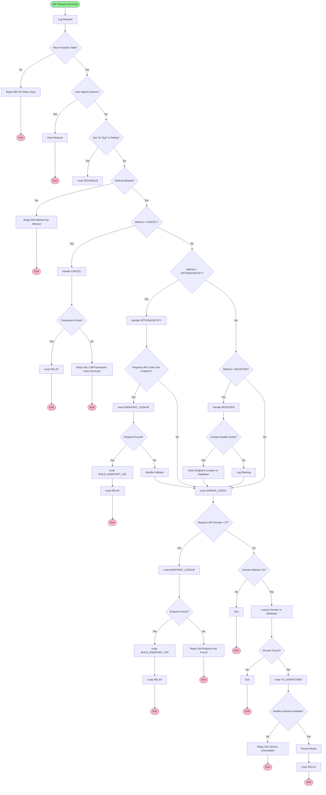

## Helper Routes

### ENDPOINT_LOOKUP

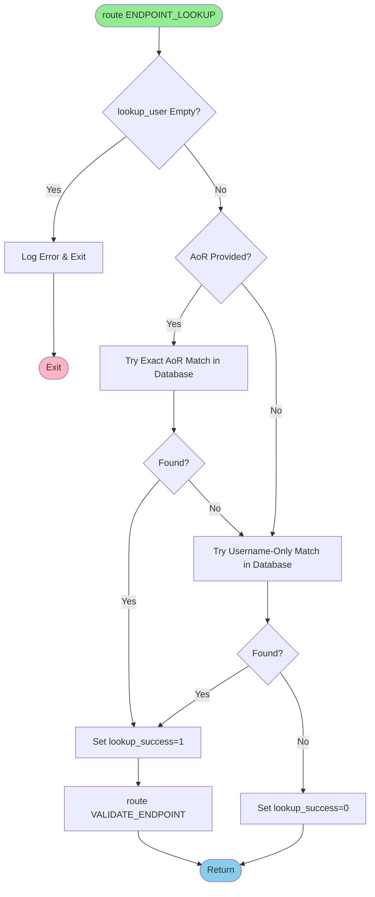

### VALIDATE_ENDPOINT

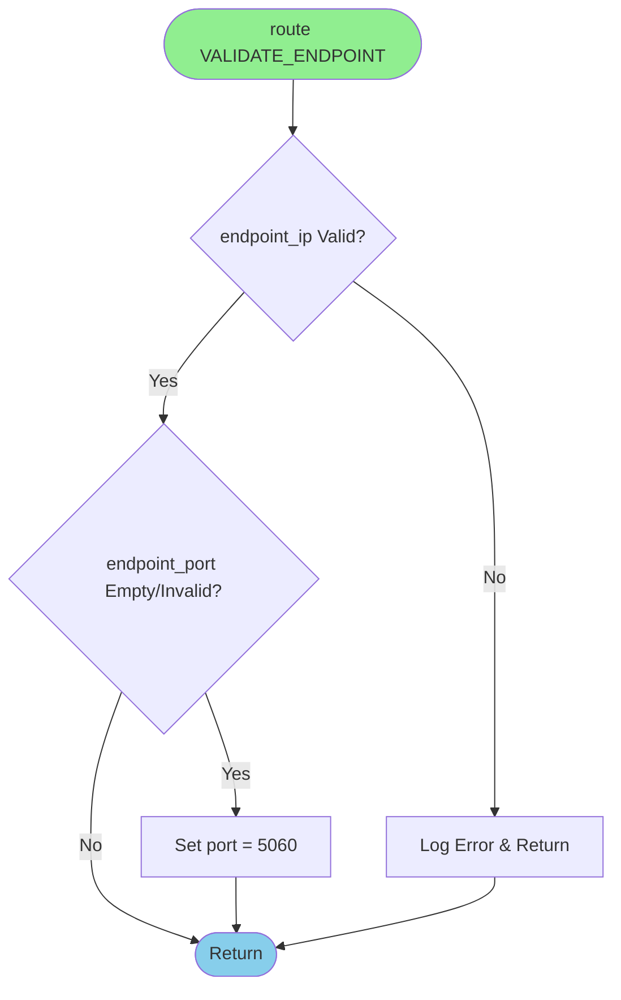

### BUILD_ENDPOINT_URI

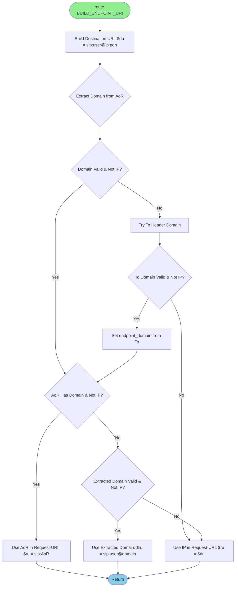

## Route Details

### route WITHINDLG (In-Dialog Requests)

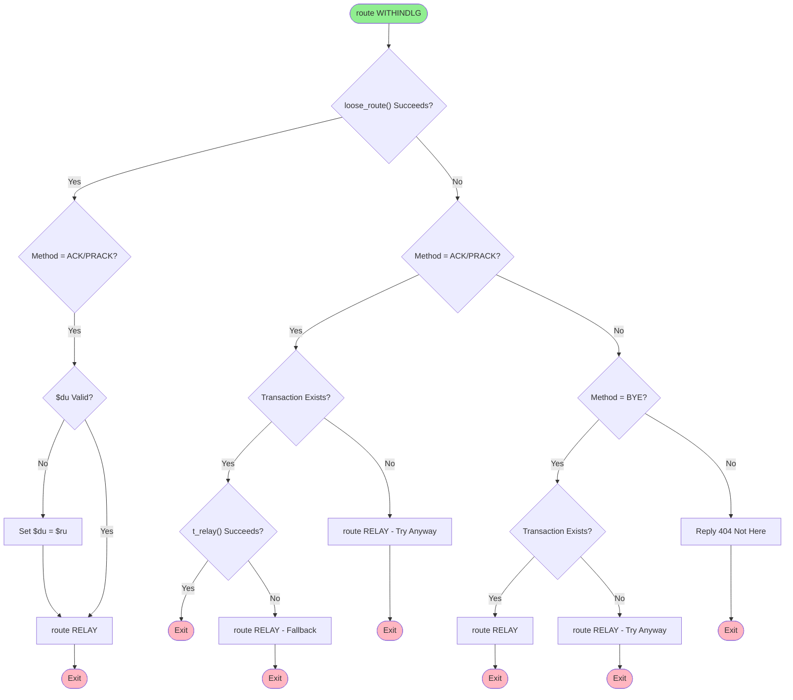

### route DOMAIN_CHECK

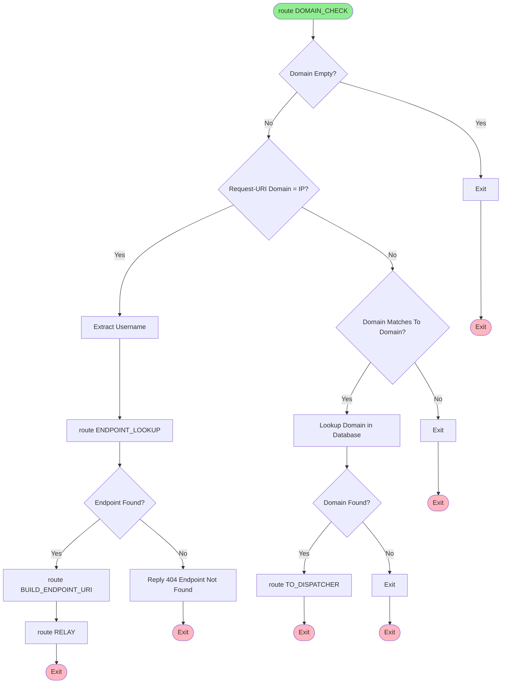

### route TO_DISPATCHER

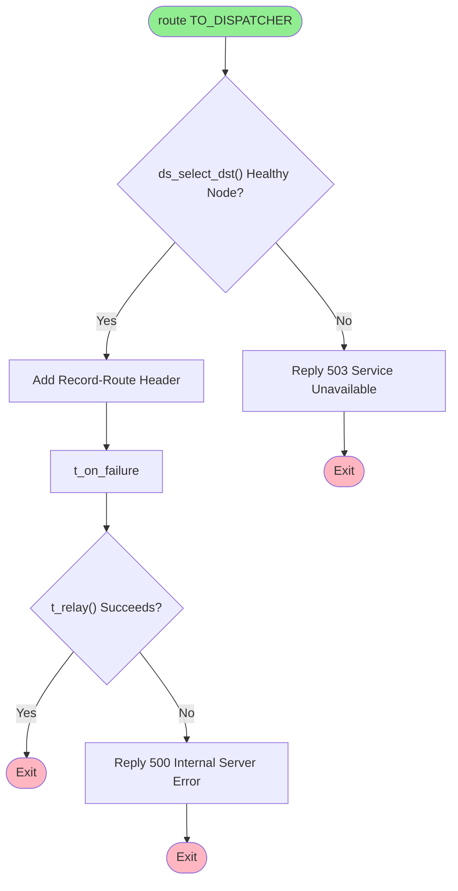

### route RELAY

```mermaid
flowchart TD
    Start([route RELAY]) --> CheckINVITE{"Method = INVITE?"}
    CheckINVITE -->|Yes| RecordRoute[Add Record-Route Header]
    CheckINVITE -->|No| CheckACKPRACKBYE{"Method = ACK/PRACK/BYE/NOTIFY?"}
    CheckACKPRACKBYE -->|Yes| CheckMethodType{"Method = ACK/PRACK?"}
    CheckMethodType -->|Yes| CheckUsername{Request-URI Has Username? Regex: ^sip:[^@]+@}
    CheckMethodType -->|No| SetNeedsNAT[Set needs_nat_fix = 1]
    CheckUsername -->|Yes| SetNeedsNAT
    CheckUsername -->|No| ArmFailure1[t_on_failure]
    SetNeedsNAT --> CheckPrivateIP{Request-URI Domain = Private IP?}
    CheckPrivateIP -->|Yes| CheckUserEmpty{Username Empty?}
    CheckPrivateIP -->|No| ArmFailure1
    CheckUserEmpty -->|No| LookupNATIP[route ENDPOINT_LOOKUP]
    CheckUserEmpty -->|Yes| ArmFailure1
    LookupNATIP --> FoundNATIP{NAT IP Found & Valid?}
    FoundNATIP -->|Yes| UpdateDU[Update $du with NAT IP]
    FoundNATIP -->|No| ArmFailure1
    UpdateDU --> ArmFailure1
    RecordRoute --> ArmFailure1
    ArmFailure1 --> CheckACKPRACK2{"Method = ACK/PRACK?"}
    CheckACKPRACK2 -->|Yes| ValidateDU{$du Valid?}
    ValidateDU -->|No| SetDUFromRU[Set $du = $ru]
    ValidateDU -->|Yes| TryTRelay{"t_relay() Succeeds?"}
    SetDUFromRU --> TryTRelay
    TryTRelay -->|Yes| End1([Exit])
    TryTRelay -->|No| TryForward{"forward() Succeeds?"}
    TryForward -->|Yes| End2([Exit])
    TryForward -->|No| End3([Exit - ACK has no response])
    CheckACKPRACK2 -->|No| CheckBYE{"Method = BYE?"}
    CheckBYE -->|Yes| ValidateBYEDU{$du Valid & Not Domain?}
    ValidateBYEDU -->|No| SetBYEDU[Set $du = $ru]
    ValidateBYEDU -->|Yes| TryTRelayBYE{"t_relay() Succeeds?"}
    SetBYEDU --> TryTRelayBYE
    TryTRelayBYE -->|Yes| End4([Exit])
    TryTRelayBYE -->|No| TryForwardBYE{"forward() Succeeds?"}
    TryForwardBYE -->|Yes| End5([Exit])
    TryForwardBYE -->|No| Reply500[Reply 500 Internal Server Error]
    CheckBYE -->|No| TryTRelayOther{"t_relay() Succeeds?"}
    TryTRelayOther -->|Yes| End6([Exit])
    TryTRelayOther -->|No| Reply500
    Reply500 --> End7([Exit])
    
    style Start fill:#90EE90
    style End1 fill:#FFB6C1
    style End2 fill:#FFB6C1
    style End3 fill:#FFB6C1
    style End4 fill:#FFB6C1
    style End5 fill:#FFB6C1
    style End6 fill:#FFB6C1
    style End7 fill:#FFB6C1
```

## Response Handling

### onreply_route

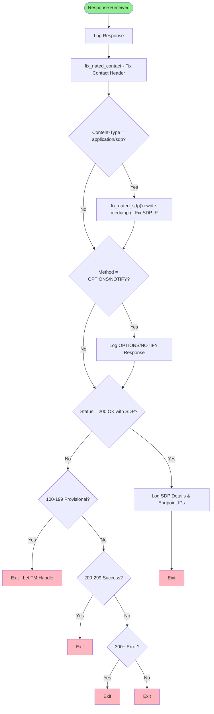

### failure_route[1]

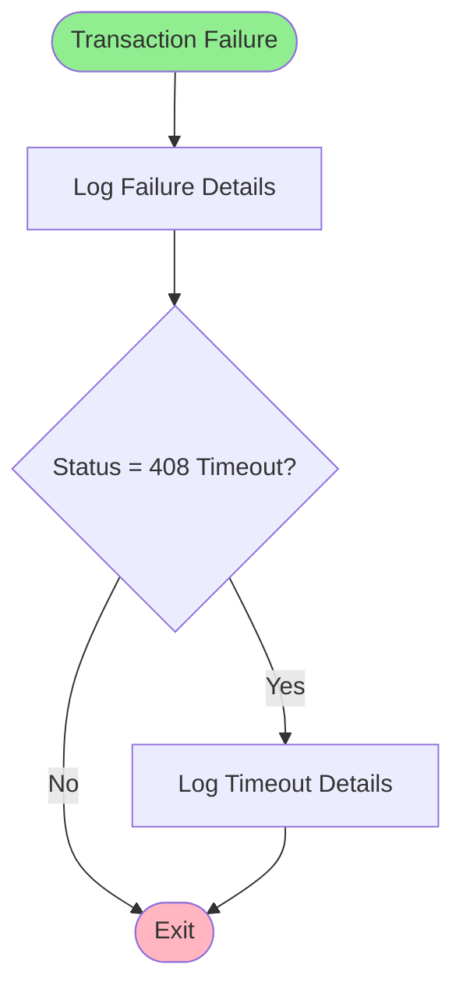

## Method-Specific Flows

### REGISTER Flow

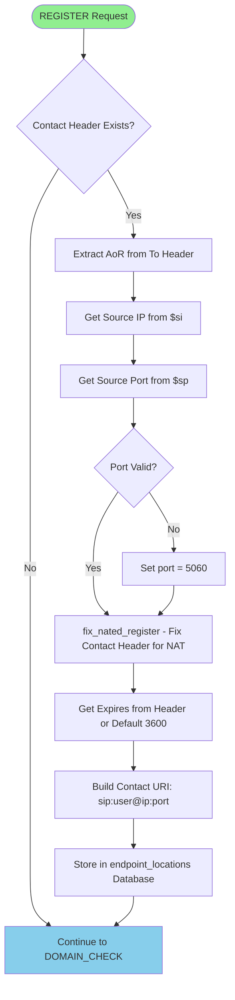

### OPTIONS/NOTIFY Flow (from Asterisk)

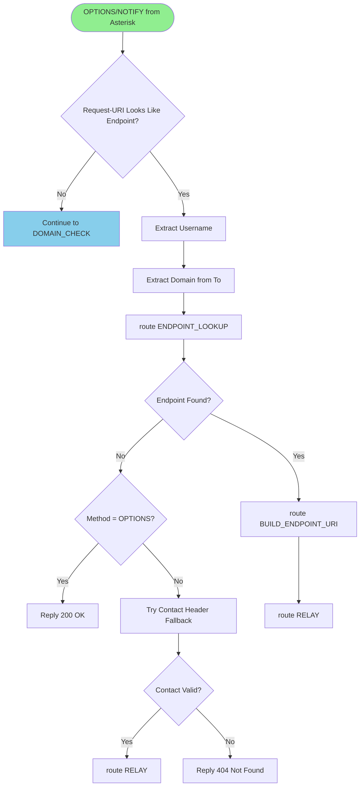

### INVITE Flow (to Endpoint)

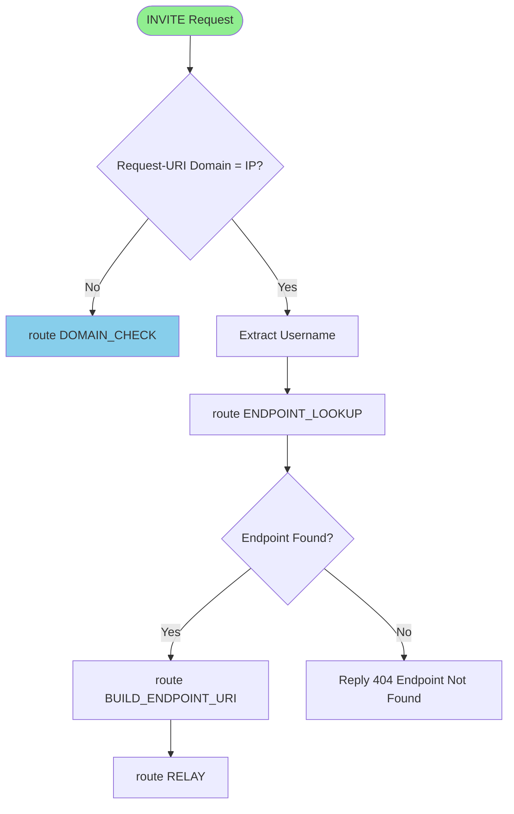

## Key Decision Points

1. **In-Dialog Detection**: `has_totag()` - Routes to `WITHINDLG` if To-tag exists
2. **Method Validation**: Allows REGISTER, INVITE, ACK, BYE, CANCEL, OPTIONS, NOTIFY, SUBSCRIBE, PRACK
3. **Endpoint Detection**: Checks if Request-URI domain is an IP address (regex pattern)
4. **Domain Lookup**: Queries `domain` table to find dispatcher setid
5. **Dispatcher Selection**: Uses `ds_select_dst()` to find healthy Asterisk backend
6. **Endpoint Lookup**: Uses `lookup("location")` function (usrloc module) to find registered endpoint IP/port
7. **NAT Traversal**: Uses `nathelper` module to fix Contact headers and SDP in responses
8. **PRACK Support**: Handles PRACK requests for 100rel (reliable provisional responses)
9. **Username Detection**: Uses regex `^sip:[^@]+@` to detect username in Request-URI (OpenSIPS 3.x compatible, `is_user()` is obsolete)
10. **ACK/PRACK NAT Fix**: Only applies NAT fix if Request-URI has username (ACKs to Asterisk have no username)
11. **BYE Handling**: Simplified validation with `t_relay()` and `forward()` fallback for expired transactions

## Database Tables Used

- **domain**: Maps domain names to dispatcher set IDs (uses `setid` column)
- **dispatcher**: Contains Asterisk backend destinations with health status
- **location**: Stores registered endpoint contact information (OpenSIPS usrloc module) ✅ **MIGRATED**

## Helper Route Dependencies

```
ENDPOINT_LOOKUP
  └─> VALIDATE_ENDPOINT

BUILD_ENDPOINT_URI
  (uses output from ENDPOINT_LOOKUP)
```

## Notes

- All routes use `exit;` to terminate processing
- Transaction module (`tm`) handles INVITE transaction state automatically
- Record-Route headers are added for INVITE requests going through OpenSIPS
- Health checks via dispatcher module send OPTIONS to Asterisk backends
- Endpoint locations are stored during REGISTER and used for direct routing
- **NAT Traversal**: `nathelper` module fixes Contact headers and SDP in responses
- **PRACK Support**: PRACK requests are handled in `WITHINDLG` route for 100rel support
- **NAT IP Lookup**: ACK, PRACK, BYE, and NOTIFY requests to endpoints behind NAT use database lookup for correct public IP
- **ACK Relay Fix**: ACKs to Asterisk (no username) skip NAT fix logic to prevent invalid URI creation
- **Username Detection**: OpenSIPS 3.x doesn't have `is_user()` - use regex `^sip:[^@]+@` to detect username
- **BYE Fallback**: BYE requests use `forward()` stateless fallback if `t_relay()` fails (transaction expired)
- **ACK/PRACK Fallback**: ACK/PRACK requests use `forward()` stateless fallback if `t_relay()` fails
- **RFC 1918 Private IPs**: All private IP ranges (10.x, 172.16-31.x, 192.168.x) are checked for NAT traversal

