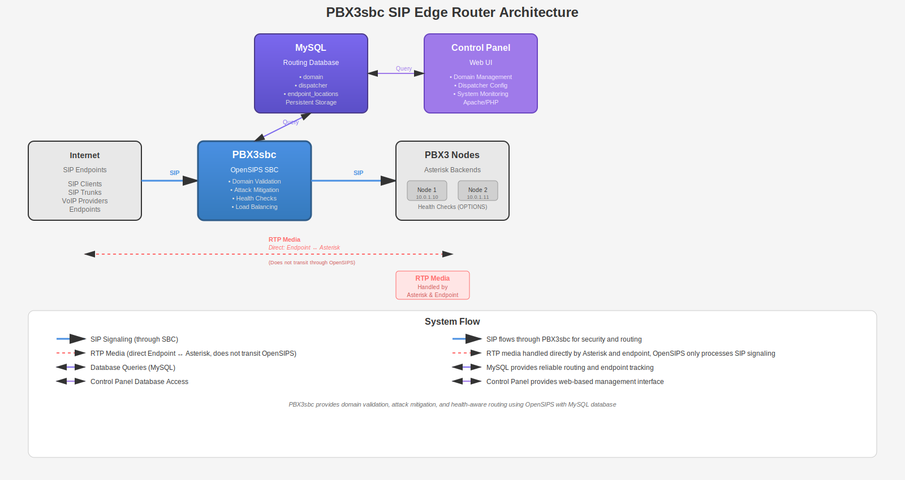

# PBX3sbc Documentation

## Overview

PBX3sbc is a SIP Edge Router built on OpenSIPS, designed to protect and route traffic to PBX3 backend nodes. It provides enterprise-grade security, high availability, and scalable multi-tenant routing with cloud-native backup capabilities.

## Key Features

- ✅ **Asterisk Protection** - Shields backend servers from SIP scans and attacks
- ✅ **Tenant Routing** - Domain-based routing with multi-tenancy support
- ✅ **High Availability** - Automatic health checks and failover
- ✅ **Horizontally Scalable** - Carrier-grade edge tier

## Quick Start

```bash
git clone https://github.com/your-org/PBX3sbc.git
cd PBX3sbc
sudo ./install.sh
```

See [Installation Guide](INSTALLATION.md) for details.

## Getting Started

- **[Project Context](PROJECT-CONTEXT.md)** - ⭐ **Start here!** Quick guide to understand the project architecture, key decisions, and current state
- **[Installation Guide](INSTALLATION.md)** - Step-by-step installation instructions
- **[Quick Start Guide](QUICKSTART.md)** - Quick reference for common tasks
- **[User Guide](USER-GUIDE.md)** - Control Panel User Guide (Domain Management, Dispatcher, etc.)
- **[Master Project Plan](MASTER-PROJECT-PLAN.md)** - Complete project plan and roadmap

## Documentation Structure

### Architecture
- **[Architecture Overview](architecture/README.md)** - System architecture and design documentation
  - [Routing Logic](architecture/routing-logic.md) - Detailed OpenSIPS routing explanation
  - [OpenSIPS Logic Diagram](architecture/OPENSIPS-LOGIC-DIAGRAM.md) - Visual routing flow

### Security
- **[Security Documentation](security/README.md)** - Security features and implementation
  - [Security Threat Detection Project](security/SECURITY-THREAT-DETECTION-PROJECT.md) - Complete security project plan
  - [Security Implementation Plan](security/SECURITY-IMPLEMENTATION-PLAN.md) - Detailed implementation guide
  - [Fail2ban Integration](security/fail2ban/README.md) - Fail2ban admin panel integration

### Guides
- **[Guides](guides/README.md)** - Technical guides and troubleshooting
  - [Troubleshooting](guides/troubleshooting/) - Common issues and solutions
  - [Technical Reference](guides/technical/) - Technical documentation

### Deployment
- **[Deployment Guides](deployment/README.md)** - Deployment checklists and guides
  - [Cloud Deployment Checklist](deployment/CLOUD-DEPLOYMENT-CHECKLIST.md)
  - [Test Deployment Checklist](deployment/TEST-DEPLOYMENT-CHECKLIST.md)
  - [Testing Guide](guides/TESTING.md)

### Monitoring
- **[Monitoring Documentation](monitoring/README.md)** - Statistics and monitoring
  - [Prometheus & Grafana Plan](monitoring/PROMETHEUS-GRAFANA-PLAN.md)
  - [Statistics Overview](monitoring/STATISTICS-OVERVIEW.md)

### Archive
- **[Archive](archive/README.md)** - Historical and completed migration documentation
  - [Migrations](archive/migrations/) - Completed migration plans
  - [Research](archive/research/) - Historical research documents

## Architecture

Uses OpenSIPS with MySQL routing database for reliable multi-tenant SIP edge routing.



## Use Cases

Suitable for hosted PBX services, multi-tenant VoIP platforms, internet-facing deployments, and large Asterisk fleets.

